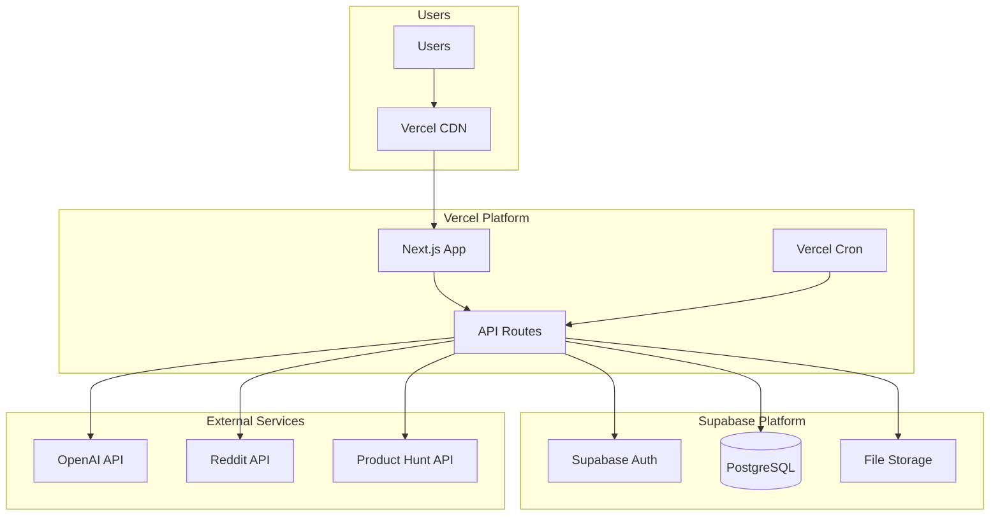

# SignalCast Fullstack Architecture Document

## Introduction

This document outlines the complete fullstack architecture for SignalCast, including backend systems, frontend implementation, and their integration. It serves as the single source of truth for AI-driven development, ensuring consistency across the entire technology stack.

This unified approach combines what would traditionally be separate backend and frontend architecture documents, streamlining the development process for modern fullstack applications where these concerns are increasingly intertwined.

### Starter Template or Existing Project

N/A - Greenfield project

The SignalCast platform is being built from scratch as a new professional intelligence system. No existing templates or codebases are being extended.

### Change Log

| Date | Version | Description | Author |
|------|---------|-------------|---------|
| 2025-08-24 | 1.0 | Initial architecture document creation | Winston (Architect) |

## High Level Architecture

### Technical Summary

SignalCast employs a simple serverless architecture deployed on Vercel and Supabase, leveraging Next.js 14 for both frontend and API routes. The system uses Vercel Cron jobs for daily content processing, OpenAI API for content synthesis, and PostgreSQL for all data storage including user preferences and content history. This MVP architecture prioritizes rapid development and deployment while maintaining the ability to scale, achieving PRD goals through focused implementation of core features without premature optimization.

### Platform and Infrastructure Choice

**Platform:** Vercel + Supabase  
**Key Services:** Vercel (Frontend + API Routes), Supabase (Auth, PostgreSQL, Storage), OpenAI API  
**Deployment Host and Regions:** US-East-1 (Primary)

### Repository Structure

**Structure:** Single Next.js application  
**Monorepo Tool:** Not needed for MVP  
**Package Organization:** Standard Next.js structure with /app directory for pages and API routes

### High Level Architecture Diagram



### Architectural Patterns

- **Server-Side Rendering (SSR):** Next.js App Router with React Server Components - _Rationale:_ Fastest initial load times and SEO benefits without complexity
- **API Routes Pattern:** Next.js API routes for all backend logic - _Rationale:_ Single deployment, shared types, no separate backend needed
- **Cron-Based Processing:** Simple daily batch jobs via Vercel Cron - _Rationale:_ Predictable costs and simpler than event streams for MVP
- **Direct Database Access:** Supabase client for all data operations - _Rationale:_ Faster development without abstraction layers for MVP
- **Component-Based UI:** React components with Tailwind CSS - _Rationale:_ Rapid UI development with utility classes

## Tech Stack

### Technology Stack Table

| Category | Technology | Version | Purpose | Rationale |
|----------|------------|---------|---------|-----------|
| Language | TypeScript | 5.3+ | Full-stack type safety | Single language, prevents errors, great DX |
| Framework | Next.js | 14.2+ | Full-stack framework | One framework for everything, Vercel optimized |
| UI Styling | Tailwind CSS | 3.4+ | Utility-first CSS | Fastest way to build UIs, no CSS files needed |
| UI Components | shadcn/ui | Latest | Copy-paste components | No dependencies, fully customizable, production-ready |
| Database | PostgreSQL (Supabase) | 15+ | All data storage | Free tier generous, includes auth and storage |
| ORM | Prisma | 5.0+ | Database access | Type-safe queries, great DX, migrations included |
| Authentication | Supabase Auth | 2.0+ | User auth | Zero-config OAuth, magic links, row-level security |
| File Storage | Supabase Storage | Latest | Content storage | Included with Supabase, no extra setup |
| API Client | Native Fetch | Built-in | HTTP requests | No library needed, works everywhere |
| Form Handling | React Hook Form | 7.0+ | Form validation | Lightweight, performant, great with TypeScript |
| Date Handling | date-fns | 3.0+ | Date utilities | Tree-shakeable, no moment.js bloat |
| Testing | Vitest | 1.2+ | Unit tests | Fast, Jest-compatible, works with Vite |
| E2E Testing | Playwright | 1.40+ | Integration tests | Reliable, fast, great debugging |
| Deployment | Vercel | Latest | Hosting platform | Zero-config deploy, preview branches, analytics included |
| Monitoring | Vercel Analytics | Built-in | Basic metrics | Free with Vercel, no setup required |
| Error Tracking | Console + Vercel | Built-in | Error logs | Start simple, add Sentry later if needed |

### MVP Technology Decisions

**AI Integration:**
- OpenAI GPT-5 mini API (default model for content synthesis)
- Simple prompt engineering (no LangChain for MVP)
- PostgreSQL for storing content history (no vector DB yet)

**External APIs:**
- Reddit API (easiest to start with)
- Product Hunt API (good for tech content)
- Add Twitter later (more complex auth)

**Key Simplifications for MVP:**
- No vector database (use PostgreSQL text search)
- No queue system (use Vercel Cron directly)
- No caching layer (rely on Vercel's edge caching)
- No complex monitoring (use Vercel's built-in logs)
- No microservices (everything in Next.js app)

## Data Models

### User
**Purpose:** Store user authentication and basic profile information

**Key Attributes:**
- id: UUID - Unique identifier (from Supabase Auth)
- email: string - User's email address
- name: string - Display name
- created_at: timestamp - Account creation date
- onboarded: boolean - Completed onboarding flow

**TypeScript Interface:**
```typescript
interface User {
  id: string;
  email: string;
  name: string | null;
  created_at: Date;
  onboarded: boolean;
}
```

**Relationships:**
- Has one UserPreferences
- Has many Content items
- Has many UserFeedback entries

### UserPreferences
**Purpose:** Store user's content preferences and interests

**Key Attributes:**
- id: UUID - Unique identifier
- user_id: UUID - Reference to User
- interests: string[] - Array of interest topics
- tech_stack: string[] - Current technologies used
- delivery_time: string - Preferred delivery time
- content_depth: enum - Brief/Detailed preference

**TypeScript Interface:**
```typescript
interface UserPreferences {
  id: string;
  user_id: string;
  interests: string[];
  tech_stack: string[];
  delivery_time: string; // "09:00" format
  content_depth: 'brief' | 'detailed';
}
```

**Relationships:**
- Belongs to one User

### Content
**Purpose:** Store synthesized content insights

**Key Attributes:**
- id: UUID - Unique identifier
- user_id: UUID - User this content is for
- title: string - Insight title
- summary: string - AI-synthesized summary
- source_urls: string[] - Original source links
- created_at: timestamp - When synthesized
- delivered: boolean - Sent to user

**TypeScript Interface:**
```typescript
interface Content {
  id: string;
  user_id: string;
  title: string;
  summary: string;
  source_urls: string[];
  created_at: Date;
  delivered: boolean;
}
```

**Relationships:**
- Belongs to one User
- Has one UserFeedback (optional)

### UserFeedback
**Purpose:** Track user engagement and ratings

**Key Attributes:**
- id: UUID - Unique identifier
- user_id: UUID - Reference to User
- content_id: UUID - Reference to Content
- rating: number - 1-5 star rating
- saved: boolean - Bookmarked for later

**TypeScript Interface:**
```typescript
interface UserFeedback {
  id: string;
  user_id: string;
  content_id: string;
  rating: number | null;
  saved: boolean;
}
```

**Relationships:**
- Belongs to one User
- Belongs to one Content

## API Specification

### REST API Endpoints (Next.js API Routes)

Since we're using Next.js API routes, all endpoints will be under `/api/`. Authentication is handled by Supabase middleware.

#### Authentication Endpoints
```typescript
// Handled by Supabase Auth UI Components
POST   /auth/signup    // User registration
POST   /auth/login     // User login  
POST   /auth/logout    // User logout
POST   /auth/reset     // Password reset
```

#### User Endpoints
```typescript
GET    /api/user/profile         // Get current user profile
PUT    /api/user/profile         // Update user profile
DELETE /api/user/account         // Delete user account
```

#### Preferences Endpoints
```typescript
GET    /api/preferences          // Get user preferences
POST   /api/preferences          // Create preferences (onboarding)
PUT    /api/preferences          // Update preferences
```

#### Content Endpoints
```typescript
GET    /api/content              // Get user's daily content feed
GET    /api/content/:id          // Get specific content detail
GET    /api/content/saved        // Get saved/bookmarked content
```

#### Feedback Endpoints  
```typescript
POST   /api/feedback/:contentId/rate  // Rate content (1-5 stars)
POST   /api/feedback/:contentId/save  // Save/bookmark content
DELETE /api/feedback/:contentId/save  // Remove bookmark
```

#### Admin/Cron Endpoints (Protected)
```typescript
POST   /api/cron/fetch-content   // Fetch from Reddit/Product Hunt
POST   /api/cron/synthesize      // Process with OpenAI
POST   /api/cron/deliver         // Mark content as delivered
```

### Example API Responses

#### Get Content Feed
```typescript
// GET /api/content
{
  "data": [
    {
      "id": "uuid",
      "title": "New React 19 Features",
      "summary": "React 19 introduces server components...",
      "source_urls": ["https://reddit.com/r/react/..."],
      "created_at": "2024-01-15T09:00:00Z",
      "feedback": {
        "rating": 4,
        "saved": true
      }
    }
  ],
  "pagination": {
    "page": 1,
    "limit": 20,
    "total": 45
  }
}
```

#### Update Preferences
```typescript
// PUT /api/preferences
// Request Body:
{
  "interests": ["AI", "React", "TypeScript"],
  "tech_stack": ["Next.js", "PostgreSQL"],
  "delivery_time": "08:00",
  "content_depth": "detailed"
}

// Response:
{
  "success": true,
  "data": { ...updated preferences }
}
```

### Error Response Format
```typescript
{
  "error": {
    "code": "UNAUTHORIZED",
    "message": "You must be logged in to access this resource",
    "status": 401
  }
}
```

## Database Schema

### Prisma Schema Definition

```prisma
// schema.prisma
generator client {
  provider = "prisma-client-js"
}

datasource db {
  provider  = "postgresql"
  url       = env("DATABASE_URL")
  directUrl = env("DIRECT_URL")
}

model User {
  id          String   @id @default(uuid())
  email       String   @unique
  name        String?
  createdAt   DateTime @default(now())
  onboarded   Boolean  @default(false)
  
  preferences UserPreferences?
  content     Content[]
  feedback    UserFeedback[]
}

model UserPreferences {
  id            String   @id @default(uuid())
  userId        String   @unique
  interests     String[] // ["AI", "React", "TypeScript"]
  techStack     String[] // ["Next.js", "PostgreSQL"]
  deliveryTime  String   @default("09:00")
  contentDepth  String   @default("brief") // "brief" | "detailed"
  
  user User @relation(fields: [userId], references: [id], onDelete: Cascade)
}

model Content {
  id         String   @id @default(uuid())
  userId     String
  title      String
  summary    String   @db.Text
  sourceUrls String[] 
  createdAt  DateTime @default(now())
  delivered  Boolean  @default(false)
  
  user     User           @relation(fields: [userId], references: [id], onDelete: Cascade)
  feedback UserFeedback?
  
  @@index([userId, delivered])
  @@index([createdAt])
}

model UserFeedback {
  id        String  @id @default(uuid())
  userId    String
  contentId String  @unique
  rating    Int?    // 1-5
  saved     Boolean @default(false)
  
  user    User    @relation(fields: [userId], references: [id], onDelete: Cascade)
  content Content @relation(fields: [contentId], references: [id], onDelete: Cascade)
  
  @@index([userId, saved])
}
```

## Project Structure

```
signalcast/
├── .env.local                  # Local environment variables
├── .gitignore
├── package.json
├── tsconfig.json
├── tailwind.config.ts
├── next.config.js
├── prisma/
│   ├── schema.prisma           # Database schema
│   └── migrations/             # Database migrations
├── public/
│   └── favicon.ico
├── app/                        # Next.js App Router
│   ├── layout.tsx              # Root layout
│   ├── page.tsx                # Home page
│   ├── globals.css             # Global styles
│   ├── (auth)/                 # Auth routes group
│   │   ├── login/page.tsx
│   │   ├── signup/page.tsx
│   │   └── reset/page.tsx
│   ├── (app)/                  # Authenticated app routes
│   │   ├── layout.tsx          # App layout with nav
│   │   ├── feed/page.tsx       # Content feed
│   │   ├── saved/page.tsx      # Saved content
│   │   ├── preferences/page.tsx
│   │   └── onboarding/page.tsx
│   └── api/                    # API routes
│       ├── user/
│       │   └── profile/route.ts
│       ├── preferences/route.ts
│       ├── content/
│       │   ├── route.ts
│       │   ├── [id]/route.ts
│       │   └── saved/route.ts
│       ├── feedback/
│       │   └── [contentId]/
│       │       ├── rate/route.ts
│       │       └── save/route.ts
│       └── cron/               # Protected cron jobs
│           ├── fetch-content/route.ts
│           ├── synthesize/route.ts
│           └── deliver/route.ts
├── components/
│   ├── ui/                     # shadcn/ui components
│   │   ├── button.tsx
│   │   ├── card.tsx
│   │   ├── input.tsx
│   │   └── ...
│   ├── auth/
│   │   ├── login-form.tsx
│   │   └── signup-form.tsx
│   ├── content/
│   │   ├── content-card.tsx
│   │   ├── content-list.tsx
│   │   └── content-detail.tsx
│   └── layout/
│       ├── header.tsx
│       └── navigation.tsx
├── lib/
│   ├── supabase/
│   │   ├── client.ts           # Browser client
│   │   ├── server.ts           # Server client
│   │   └── middleware.ts       # Auth middleware
│   ├── prisma.ts               # Prisma client
│   ├── openai.ts               # OpenAI client
│   └── utils.ts                # Utility functions
├── hooks/
│   ├── use-user.ts
│   └── use-content.ts
└── types/
    └── index.ts                # Shared TypeScript types
```

## Development Workflow

### Local Development Setup

```bash
# Prerequisites
node --version  # v18+
pnpm --version  # v8+ (or npm/yarn)

# Clone and install
git clone <repo>
cd signalcast
pnpm install

# Setup environment
cp .env.example .env.local
# Add your Supabase and OpenAI keys

# Setup database
pnpm prisma generate
pnpm prisma db push

# Run development server
pnpm dev
# Open http://localhost:3000
```

### Environment Variables

```bash
# .env.local

# Supabase
NEXT_PUBLIC_SUPABASE_URL=your-project-url
NEXT_PUBLIC_SUPABASE_ANON_KEY=your-anon-key
SUPABASE_SERVICE_ROLE_KEY=your-service-key

# Database (from Supabase)
DATABASE_URL=postgresql://...
DIRECT_URL=postgresql://...

# OpenAI
OPENAI_API_KEY=sk-...

# Reddit API
REDDIT_CLIENT_ID=...
REDDIT_CLIENT_SECRET=...

# Product Hunt API  
PRODUCT_HUNT_TOKEN=...

# Cron Secret (for Vercel)
CRON_SECRET=random-secret-string
```

### Development Commands

```bash
# Development
pnpm dev              # Start dev server
pnpm build            # Build for production
pnpm start            # Start production server

# Database
pnpm prisma studio    # Open Prisma Studio
pnpm prisma generate  # Generate Prisma Client
pnpm prisma db push   # Push schema changes
pnpm prisma migrate dev # Create migration

# Testing
pnpm test            # Run unit tests
pnpm test:e2e        # Run E2E tests
pnpm lint            # Run ESLint
pnpm type-check      # Run TypeScript check
```

## Database Schema

_[To be continued - Section 9]_

## Deployment

### Vercel Deployment

```bash
# Install Vercel CLI
pnpm i -g vercel

# Deploy
vercel

# Set environment variables in Vercel Dashboard
# Project Settings > Environment Variables
```

### Production Configuration

```javascript
// vercel.json
{
  "crons": [
    {
      "path": "/api/cron/fetch-content",
      "schedule": "0 6 * * *"  // 6 AM UTC daily
    },
    {
      "path": "/api/cron/synthesize",
      "schedule": "0 7 * * *"  // 7 AM UTC daily
    },
    {
      "path": "/api/cron/deliver",
      "schedule": "0 8 * * *"  // 8 AM UTC daily
    }
  ]
}
```

### Monitoring

- **Vercel Analytics**: Automatically enabled for performance metrics
- **Vercel Functions**: Monitor API route performance in dashboard
- **Supabase Dashboard**: Monitor database queries and auth metrics
- **Error Logs**: Check Vercel Functions logs for errors

## Coding Standards

### Critical Rules for AI Development

- **Use Prisma for all database operations:** Never write raw SQL, use Prisma client
- **Type everything:** No `any` types, define interfaces for all data structures
- **Use app directory:** All pages go in /app, not /pages (Next.js 14)
- **Server Components by default:** Only use 'use client' when needed
- **Environment variables:** Always validate with zod at startup
- **API routes:** Return consistent JSON structure with error handling
- **Use Supabase Auth:** Don't implement custom auth logic
- **Tailwind only:** No custom CSS files except globals.css

### File Naming Conventions

- Components: PascalCase (`ContentCard.tsx`)
- Utilities: camelCase (`formatDate.ts`)
- API Routes: kebab-case folders (`/api/user-profile/route.ts`)
- Types: PascalCase with 'I' prefix for interfaces (`IUser`)

## Security Considerations

### MVP Security Checklist

- ✅ Use Supabase Row Level Security (RLS) for data access
- ✅ Validate all API inputs with Zod
- ✅ Protect cron endpoints with secret header
- ✅ Rate limit API routes with Vercel Edge Config
- ✅ Sanitize user inputs before storing
- ✅ Use environment variables for all secrets
- ✅ Enable CORS only for your domain
- ✅ Implement proper error handling without leaking details

## Testing Strategy

### MVP Testing Approach

```typescript
// Simple unit test example with Vitest
// tests/api/content.test.ts
import { describe, it, expect } from 'vitest'
import { GET } from '@/app/api/content/route'

describe('Content API', () => {
  it('returns user content', async () => {
    const response = await GET(request)
    const data = await response.json()
    expect(data).toHaveProperty('data')
  })
})
```

### Testing Priorities for MVP

1. **Critical Path E2E Tests** (Playwright)
   - User signup/login flow
   - Onboarding completion
   - Content viewing and rating

2. **API Route Tests** (Vitest)
   - Authentication middleware
   - Data validation
   - Error handling

3. **Component Tests** (React Testing Library)
   - Forms with validation
   - Content card interactions
   - Navigation flows

## Next Steps for Implementation

### Phase 1: Foundation (Week 1)
1. Set up Next.js project with TypeScript
2. Configure Supabase (Auth + Database)
3. Set up Prisma and create schema
4. Implement authentication flows
5. Deploy to Vercel

### Phase 2: Core Features (Week 2-3)
1. Build onboarding flow
2. Create content feed UI
3. Implement Reddit API integration
4. Add OpenAI synthesis (basic)
5. Set up Vercel Cron jobs

### Phase 3: Enhancement (Week 4)
1. Add rating/feedback system
2. Implement saved content
3. Add Product Hunt integration
4. Improve AI prompts
5. Add basic analytics

## Summary

This architecture provides a simple, fast-to-implement foundation for SignalCast MVP. Key decisions:

- **Single Next.js app** instead of microservices
- **Supabase for everything** (auth, database, storage)
- **Minimal dependencies** (no queues, caches, or complex tools)
- **PostgreSQL text search** instead of vector database for MVP
- **Direct API calls** instead of abstraction layers

This approach allows you to:
- Launch in 4 weeks instead of 4 months
- Test core value proposition quickly
- Iterate based on user feedback
- Scale up architecture when needed

Total estimated setup time: **1 day**
Total estimated development time: **3-4 weeks** for MVP