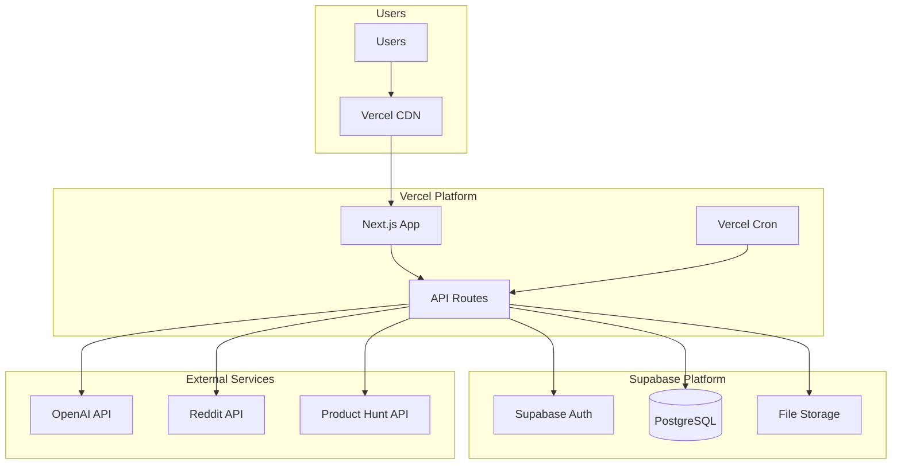

# High Level Architecture

## Technical Summary

SignalCast employs a simple serverless architecture deployed on Vercel and Supabase, leveraging Next.js 14 for both frontend and API routes. The system uses Vercel Cron jobs for daily content processing, OpenAI API for content synthesis, and PostgreSQL for all data storage including user preferences and content history. This MVP architecture prioritizes rapid development and deployment while maintaining the ability to scale, achieving PRD goals through focused implementation of core features without premature optimization.

## Platform and Infrastructure Choice

**Platform:** Vercel + Supabase  
**Key Services:** Vercel (Frontend + API Routes), Supabase (Auth, PostgreSQL, Storage), OpenAI API  
**Deployment Host and Regions:** US-East-1 (Primary)

## Repository Structure

**Structure:** Single Next.js application  
**Monorepo Tool:** Not needed for MVP  
**Package Organization:** Standard Next.js structure with /app directory for pages and API routes

## High Level Architecture Diagram

## Architectural Patterns

- **Server-Side Rendering (SSR):** Next.js App Router with React Server Components - _Rationale:_ Fastest initial load times and SEO benefits without complexity
- **API Routes Pattern:** Next.js API routes for all backend logic - _Rationale:_ Single deployment, shared types, no separate backend needed
- **Cron-Based Processing:** Simple daily batch jobs via Vercel Cron - _Rationale:_ Predictable costs and simpler than event streams for MVP
- **Direct Database Access:** Supabase client for all data operations - _Rationale:_ Faster development without abstraction layers for MVP
- **Component-Based UI:** React components with Tailwind CSS - _Rationale:_ Rapid UI development with utility classes
